# Snowflake Character Sequence Loader

A metadata-driven Snowflake ingestion framework that dynamically derives target schemas from delimited source-file headers, creates destination tables at runtime, normalizes blank fields to SQL `NULL`, and loads heterogeneous exports through one reusable stored procedure.

## Project status

**Phase 3 baseline: complete and validated**

The protected Phase 3 implementation was validated across **23 structurally different source files** without changing the procedure.

- Maximum validated width: **181 columns**
- Largest validated file: **210,575 rows**
- Dynamic table creation
- Dynamic SQL generation
- Original quoted header names preserved
- Blank strings converted to SQL `NULL`
- Different schemas, row counts, and file sizes handled without code changes

## Problem

Legacy export systems often produce line-oriented text files where the first record contains column names, later records contain delimited values, each file can have a different schema, and manually creating one loader per file does not scale.

This project replaces file-specific ingestion SQL with one reusable Snowflake Scripting procedure.

## Architecture

```mermaid
flowchart LR
    A[Character-sequence file] --> B[Snowflake internal stage]
    B --> C[Named file format]
    C --> D[LOAD_CHARACTER_SEQUENCE_FILE]
    D --> E[Read first record as header]
    E --> F[Derive column count and identifiers]
    F --> G[Generate CREATE TABLE SQL]
    G --> H[Generate NULL-normalizing SELECT]
    H --> I[Load non-header records]
    I --> J[Count loaded rows]
    J --> K[Return load summary]
```



## Source format

Each physical line is read as one text record. Values inside the line are separated by:

```text
|~|
```

Example:

```text
EmployeeID|~|EmployeeStatus|~|PublicNotes
10001|~|Active|~|Eligible for review
10002|~||~|
```

The loader creates three `TEXT` columns and converts the blank values in the last row to SQL `NULL`.

## Procedure behavior

`LOAD_CHARACTER_SEQUENCE_FILE(FILE_NAME, TARGET_TABLE)`:

1. Builds the staged-file path.
2. Reads the first physical record as the header.
3. Determines the number of columns dynamically.
4. Preserves original header capitalization using quoted identifiers.
5. Escapes embedded double quotes in header names.
6. Generates one destination `TEXT` column per source field.
7. Generates one `NULLIF(SPLIT(...), '')` expression per field.
8. Creates or replaces the target table.
9. Loads every record after the header.
10. Counts the loaded rows.
11. Returns a concise load summary.

## Example usage

```sql
CALL PORTFOLIO_DB.INGESTION.LOAD_CHARACTER_SEQUENCE_FILE(
    'employee_sample.txt',
    'EMPLOYEE_SAMPLE'
);
```

Example response:

```text
SUCCESS | File: employee_sample.txt | Table: PORTFOLIO_DB.INGESTION.EMPLOYEE_SAMPLE | Columns: 4 | Rows loaded: 3
```

## Repository structure

```text
sql/
  setup/
  procedures/
  examples/
  validation/
sample_data/
docs/
releases/
```

## Engineering boundaries

This repository protects the validated Phase 3 implementation. It is a proven metadata-driven raw-ingestion framework, but it is not yet a fully hardened production ingestion service.

Known Phase 3 limitations include destructive `CREATE OR REPLACE TABLE` behavior, no transaction-safe publication step, no persistent audit log, no reject-row capture, no duplicate-header handling, no strict file-name or table-name allow-list, a practical 1,000-column generator limit, and no automated CI testing.

These items are intentionally reserved for Phase 4 so the Phase 3 baseline remains reproducible.

## Phase 4 roadmap

Planned hardening work includes strict input validation, duplicate and blank header checks, staged-table loading and atomic publication, structured audit and error logging, rejected-record capture, independent source-to-target reconciliation, configurable object names, automated tests, and safer deployment patterns.

## Security and sanitization

The public repository uses generic Snowflake object names and synthetic data. It does not publish employer-specific infrastructure names, production identifiers, internal users, roles, warehouses, private source data, or unredacted screenshots.

## License

MIT License.

## Protected release

Planned baseline tag:

```text
v1.0.0-phase3
```
